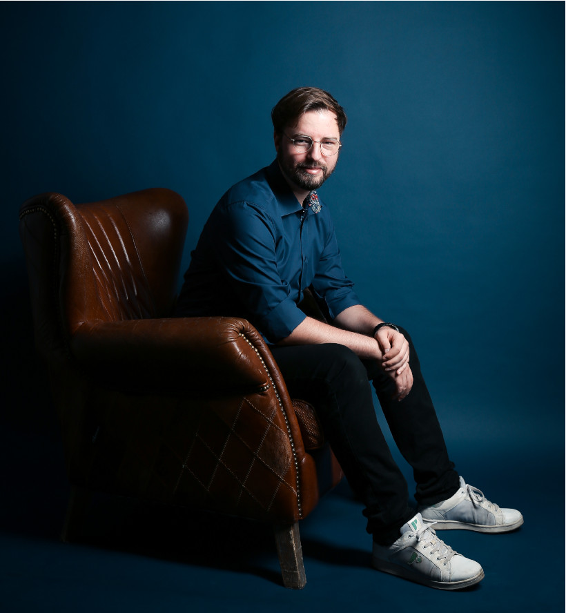

# About Me

<v-row style="margin-top:30px; margin-bottom:30px">
  <v-col cols="12" lg="6" class="text-center">
    
  </v-col>
<v-col cols="12" lg="6" class="text-body-1" style="margin:auto;">
Hey there! 

My name is Dominik.  
I am a passionate Product Manager with an engineering background and over 7 years experience in the IT industry. 
And I am very dedicated to empower others through talks, blogs, workshops, and direct mentoring.

I love product management, product ops, cloud, people, improving lifes, good food, football, history and more. 

Want to know more? Alright then, here is my CV. Get in touch if you want to know something specific. 
  </v-col>         
</v-row>

## Practical Experience

Since 10/2022 **Product Manager Kubernetes Platform**\
*Giant Swarm GmbH*
* Created a new Kubernetes Foundation team and aligned team and organisation on a compelling vision driving outcome focus.
* Reduced friction and pain around releases by reshaping and aligning on a common release process across all teams and customers.
* Introduced a new Infrastructure Provider for our Platform Product allowing us to onboard a new key account to Microsoft's Azure Cloud.
* Helped shape our internal product management practice, product marketing, product-revenue-alignment and events by contributing to multiple internal community-of-practices. 

02/2021 - 09/2022 **Technical Product Owner STACKIT AppCloud**\
*Giant Swarm GmbH*
* Took over the PaaS product based on Cloud Foundry and aligned team and stakeholders on a new, clear product vision.
* Improved developer productivity by introducing and aligning on easy agile processes and product management best practices.
* Helped onboard multiple customers and streamlined onboarding process with documentation, talks and workshops.
* Gained customer trust by significantly reducing used error budget and created monitoring transparency for key components.

04/2019 – 02/2021 **DevLead Mindshift CMS – Lidl Online Shop**\
*Schwarz IT KG*
* Rolled out a new CMS platform to multiple countries making internal customers happy with significantly improved and intuitive UX allowing faster campaign cycles.
* Helped empower team to become cross-functional and introduced DevOps Mindset while migrating the online shop CMS platform to the cloud.
* Significantly reduced our delivery speed by improving processes and automation and reducing our large technical debt backlog to nearly zero.

02/2018 – 03/2019 **Software Engineer Lidl Online Shop**\
*Schwarz IT KG / Lidl Digital International GmbH & Co.KG*
* Helped design and build new online shop platform based on micro-frontend architecture and create communities of practice.

04/2015 – 01/2018 **Software Engineer Kaufland Online Shop**\
*Kaufland Informationssysteme GmbH & Co.KG*
* First as a working student then as a full time employee working on test and delivery automation, as well as driving customer conversion rates in the shop frontend.

## Education

Since 2021 **Working part-time on my Master in Business IT**\
*Remote University Hagen*

2017 **Bachelor of Science – Software Engineering**\
Thesis Title: Grundlagen der API - Von der Konzeption bis zur technischen Umsetzung und Wartung\
API Fundamentals – from conception to technical implementation and maintenance\
*Heilbronn University*

## Others
Other Experiences include:
* I love to actively contribute to the community
  * Speaker on conferences and MeetUps like WJAX 2018, DevOpsCon 2021 and 2022, WeAreDevelopers 2022, Digitale Leute Summit 2023, Product Owner Days 2024, and more
  * Wrote multiple Blog and Magazine Articles about various topics around Platforms, Cloud and APIs and a book about API Design with GraphQL (ISDN: 978-3-86490-784-5)
  * Actively contributing to the Cloud Native Computing Foundation, for example in the Platforms Working Group
  * Created the concept of and organised two conference formats with the MeetIT Heilbronn and Schwarz IT internal Developer Conference SITCon
* 2019-2020 Lecturer for fundamentals of software engineering at Heilbronn University
* 2019-2021 Culture- and Change Agent for Schwarz IT, actively supporting the enterprise-wide organisational and cultural changes.
* 2018-2019 Board Member of the IT Networking Club connect.it Heilbronn
* 2015-2017 Head of the Students Representation of the Faculty IT at Heilbronn University

For more see [Portfolio](/portfolio)