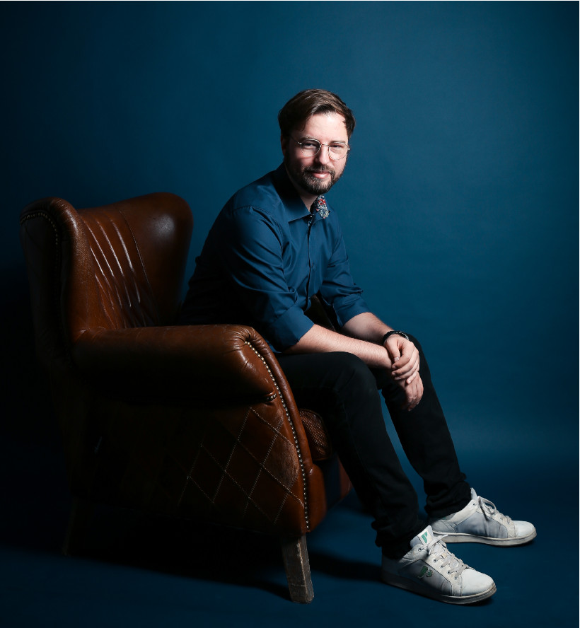

# About Me

<v-row style="margin-top:30px; margin-bottom:30px">
  <v-col cols="12" lg="6" class="text-center">
    
  </v-col>
<v-col cols="12" lg="6" class="text-body-1" style="margin:auto;">
Hey there! My name is Dominik.

I'm a Product Leader with an engineering background and over a decade in IT. My work sits at the intersection of product and complex technical platforms: PaaS, developer platforms, observability, and now agentic systems, which for me is the natural next step of platform engineering, taking it from empowering developers to empowering whole organizations. Product thinking is the through-line across all of them, and applying it well is what turns powerful technology into products people actually adopt.

Today I'm Group Product Manager for Platforms at Giant Swarm, leading strategy and go-to-market across five teams. Right now that means two things: reshaping how we sell with a modular offering customers can start small on and grow, and driving Giant Swarm's first AI product, a multi-agent orchestration platform, from prototype to first customers.

That same focus runs through most of my talks and writing, collected on the [Portfolio](/portfolio) page. The roles below show what it looks like when applied in practice.

I love product management, product ops, cloud, people, improving lives, good food, applied AI, history and more.

Get in touch if you want to know something specific.
  </v-col>         
</v-row>

## Practical Experience

Since 01/2026 **Group Product Manager, Platforms**\
*Giant Swarm GmbH*
* Driving Giant Swarm's first AI product as product lead: infrastructure to run AI agents as workloads (composable agents, agent runtime, and tool access), so organisations can put agents to work with confidence. Leading it end to end from prototype to first customers.
* Leading product strategy and go-to-market for Giant Swarm's platform portfolio across five teams. The current priority is to grow the customer base and total revenue through scale rather than through high upfront commitments: a new modular offering lets customers start at a four-figure entry point instead of a six-figure one, with a clear cross- and upsell path from there.

10/2022 - 12/2025 **Platform Product Manager, Observability**\
*Giant Swarm GmbH*
* Led the Observability Platform through its evolution from an internal-only monitoring stack with limited customer adoption into a separately sold product line that today monitors hundreds of customer clusters in production and established a new product category for Giant Swarm alongside the core platform offering.
* Owned the product end to end across positioning, roadmap, pricing, and the close collaboration with engineering, sales, and marketing needed to bring it to market. This work also helped seed Giant Swarm's broader move toward a more modular commercial model.

02/2021 - 09/2022 **Technical Product Owner STACKIT AppCloud**\
*Schwarz IT KG / STACKIT*
* Owned the product strategy and roadmap for AppCloud, a Cloud Foundry-based PaaS that became the first STACKIT product to reach production. Brought the first internal teams and the first external paying customers onto the platform.
* Built stakeholder and customer trust through a clear product vision, transparent monitoring, and significantly reduced error-budget burn, and shaped the strategic positioning of AppCloud against raw Kubernetes-based alternatives.

04/2019 – 02/2021 **DevLead Mindshift CMS – Lidl Online Shop**\
*Schwarz IT KG*
* Led the Lidl Online Shop CMS team through its migration to the cloud and its transition into a cross-functional DevOps unit. Rolled the new platform out to multiple countries with significantly faster delivery cycles and a more intuitive UX for internal users.
* Reduced a large legacy technical debt backlog close to zero through automation, deliberate process work, and a cultural shift in how the team approached delivery.

02/2018 – 03/2019 **Software Engineer Lidl Online Shop**\
*Schwarz IT KG / Lidl Digital International GmbH & Co.KG*
* Co-designed and built the new Lidl Online Shop platform on a micro-frontend architecture, and helped establish the engineering communities of practice that supported it.

04/2015 – 01/2018 **Software Engineer Kaufland Online Shop**\
*Kaufland Informationssysteme GmbH & Co.KG*
* From working student to full-time engineer, owned parts of test and delivery automation as well as the shop frontend, with measurable contributions to customer conversion.

## Education

Since 2021 **Working part-time on my Master in Business IT**\
*Remote University Hagen*

2017 **Bachelor of Science – Software Engineering**\
Thesis Title: Grundlagen der API - Von der Konzeption bis zur technischen Umsetzung und Wartung\
API Fundamentals – from conception to technical implementation and maintenance\
*Heilbronn University*

## Others

I love to actively contribute to the community. The [Portfolio](/portfolio) has the full collection of talks and writing. The recurring topics there are product thinking in platform engineering, platform-as-a-product, observability, and increasingly agentic engineering as the natural next step. I have spoken on these at conferences including KubeCon, ContainerDays, DevOpsCon, WeAreDevelopers, OSMC, Cloud Native Summit, and Continuous Lifecycle.

A few other things worth mentioning:
* Active contributor to the **Cloud Native Computing Foundation**, including its Platforms Working Group.
* Author of the book **API Design with GraphQL** (ISBN 978-3-86490-784-5).
* Co-created and organised two conference formats: **MeetIT Heilbronn** and the Schwarz IT internal developer conference **SITCon**.
* **2019–2020** Lecturer for fundamentals of software engineering at *Heilbronn University*.
* **2019–2021** Culture and Change Agent for *Schwarz IT*, supporting enterprise-wide organisational and cultural change.
* **2018–2019** Board Member of the IT Networking Club **connect.it Heilbronn**.
* **2015–2017** Head of the Students' Representation of the Faculty IT at *Heilbronn University*.

For more see [Portfolio](/portfolio).
