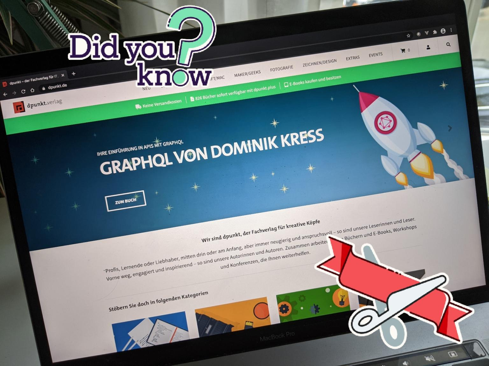

# My Portfolio

<v-row style="margin-top:30px; margin-bottom:30px">
  <v-col cols="12" lg="6" class="text-center">
    
  </v-col>
<v-col cols="12" lg="6" class="text-body-1" style="margin:auto;">
Hey there! 

This is a short insight into things I did in the past.
  
This is not the complete and extensive list of all the things I ever did, but should only give a small overview over different
areas I am active in and show some examples of the things I did in these areas. 
 
If you want to know more about the listed things or things, I did not list here, don't hesitate to get in touch with me!
  </v-col>         
</v-row>

## Publications

**Introducing the Observability Platform**\
2024, on [Giant Swarm Blog](https://www.giantswarm.io/blog/introducing-the-observability-platform)

**Platform as a Product Research** - Now with a Survey!\
2024, on [Cloud Native Computing Foundation Blog](https://tag-app-delivery.cncf.io/blog/call-participation-paap-survey/)

**Product Thinking for Platforms**\
2024, on [Cloud Native Computing Foundation Blog](https://tag-app-delivery.cncf.io/blog/product-thinking-for-platforms/)

**How Platform-as-a-Product Drives Cloud-Native Platform Maturity**\
2024, on [Giant Swarm Blog](https://www.giantswarm.io/blog/maximizing-value-with-kubernetes-as-a-product-fulfilling-the-promise-of-the-cloud)\
2024, on [Cloud Native Now](https://cloudnativenow.com/topics/how-platform-as-a-product-drives-cloud-native-platform-maturity/)

**Telepresence als Tooltipp** - Kubernetes-Applikation lokal entwickeln\
2024, on [iX Magazin/heise+](https://www.heise.de/ratgeber/Telepresence-als-Tooltipp-Kubernetes-Applikation-lokal-entwickeln-9613303.html)

**Maximizing Value with Kubernetes-as-a-Product** - Scaling the Mountain of Possibilities\
2023, on [VMBlog](https://vmblog.com/archive/2023/10/10/maximizing-value-with-kubernetes-as-a-product-scaling-the-mountain-of-possibilities.aspx)

**Einstieg in GitHub Actions** - 3 part tutorial series on CI/CD with GitHub Actions\
Part 1, Einstieg in GitHub Actions: 2022, in [iX Ausgabe 7.2022](https://shop.heise.de/ix-07-2022/Print) or [on heise+.](https://www.heise.de/ratgeber/Softwareentwicklung-Einstieg-in-GitHub-Actions-7148260.html)\
Part 2, GitHub Actions und Container-Registries: 2022, in [iX Ausgabe 8.2022](https://shop.heise.de/ix-08-2022/Print) or [on heise+.](https://www.heise.de/ratgeber/Wie-Sie-Container-mit-GitHub-Actions-automatisiert-publizieren-7184373.html)\
Part 3, Cloud Deployment mit GitHub Actions: 2022, in [iX Ausgabe 9.2022](https://shop.heise.de/ix-09-2022/Print) or [on heise+.](https://www.heise.de/ratgeber/So-funktioniert-Cloud-Deployment-mit-GitHub-Actions-7244444.html)

**Die Cloud hat viele Gesichter** - Cloud Foundry: Eine Open-Source-Cloud-Plattfrom als einfache Alternative zu Kubernetes\
2022, in [JavaMagazin Ausgabe 2.2022](https://entwickler.de/magazine-ebooks/java-magazin/java-magazin-22022)
2022, in [Windows.developer Magazin Ausgabe 4.2022](https://entwickler.de/magazine-ebooks/windows-developer/windows-developer-42022)

**The Future of Cloud is Abstraction**\
2022, on [SchwarzIT Techblog](https://techblog.schwarz/posts/the-future-of-the-cloud-is-abstraction/)

**Vom Entwickler zum Produkt Owner** - Der Produktwerker Podcast\
2021, Guest on [Product Werker Podcast](https://produktwerker.de/vom-entwickler-zum-produkt-owner/)

**Why do so many companies have a hard time getting new IT Specialists?**\
2021, on [Medium](https://rotfuks.medium.com/why-do-so-many-companies-have-a-hard-time-getting-new-it-specialists-31af77e8622)

**GraphQL als API-Gateway** - 2 part tutorial series on API-Gateways with GraphQL\
Part 1: Grundlagen, Theorie, Design. 2021, on [heise.de](https://www.heise.de/hintergrund/GraphQL-als-API-Gateway-Teil-1-Grundlagen-Theorie-Design-6049124.html)\
Part 2: Technische Beispielimplementierung. 2021,  on [heise.de](https://www.heise.de/hintergrund/GraphQL-als-API-Gateway-Teil-2-Technische-Beispielimplementierung-6063845.html)

**GraphQL** – Eine Einführung in APIs mit GraphQL **- Book**\
2020, on [dpunkt.verlag](https://dpunkt.de/produkt/graphql/)

## Events & Talks

**Think Big: Monitoring Stack was yesterday** - Observability Platform at scale!\
2025, at [Cloud Native Summit Munich](https://cloudnativesummit.de/schedule/)\
2025, at [Mastering Observability](https://www.mastering-obs.de/veranstaltung-83481-se-0-think-big-monitoring-stack-war-gestern--observability-platform-at-scale.html)

**You don’t need to be Linus Torvalds** - Open Source contributions for non-tech people\
2025, at [Open Source @ Siemens](https://opensource.siemens.com/events/2025/#june-4th)

**Platform-as-a-Product** - First insights from CNCF Platform Working Group's ongoing research\
2025, at [KubeCon CoLocated Platform Engineering Day](https://www.youtube.com/watch?v=DoiaHfl9Y7Y)

**Platform-as-a-Product** - Wieso Produktdenken deine (Cloud-)Plattform besser macht!\
2025, at [Navigate Congress](https://www.youtube.com/watch?v=h3AXyHngm38)

**Sustainability and the Cloud**\
2024, at [Continuous Lifecycle/ContainerConf](https://www.continuouslifecycle.de/veranstaltung-22288-0-nachhaltigkeit-in-der-cloud.html)\
2024, at [Pulumi User Group Meetup](https://www.meetup.com/de-DE/berlin-pulumi-user-group/events/304081553/)

**What the Heck is Platform-as-a-Product?** How Product Thinking drives your platform maturity\
2024, at [ContainerDays Conference](https://www.youtube.com/watch?v=t5LCrTxPDgQ)

**What the Heck is the CNCF Platform Working Group?** Insights from a CNCF Platform Working Group Member!\
2024, at [Pulumi User Group Meetup](https://www.youtube.com/watch?v=NUPK5CCm6XA)

**Maximizing Value with Kubernetes as a Product** - Fulfilling the promise of the cloud\
2024, at [Berlin Kubernetes and Cloud Native Meetup](https://www.youtube.com/watch?v=lxUNUh9sWSI&t=4720s) 

**CNCF Platform WG: Platform-as-a-Product**\
2024, at [Platformers Community Podcast](https://www.youtube.com/watch?v=Xw4ruQCFk6g)

**Infrastruktur als Produkt:** Transparenter Wert selbst in komplexesten Umgebungen\
2024, at [Inside Agile Online Conference](https://asu.inside-agile.de/veranstaltung-21484-se-0-effektives-produktmanagement-in-technisch-anspruchsvollen-umgebungen-infrastruktur-als-produkt.html)\
2024, at [Product Owner Days Cologne](https://product-owner-day.de/veranstaltung-21568-0-infrastruktur-als-produkt-transparenter-wert-selbst-in-komplexesten-umgebungen.html)

**Product Journey Value Mapping** - Paving the Way for Continuous Value Delivery\
2023, at [DLSummit Cologne](https://www.digitale-leute.de/summit/23/schedule/product-journey-value-mapping-paving-the-way-for-continuous-value-delivery/#start)

**The Future of Cloud is Abstraction** - Why Kubernetes is not the Endgame for STACKIT\
2022, at [DevOpsCon Berlin](https://devopscon.io/cloud-platforms-serverless/the-future-of-cloud-is-abstraction-why-kubernetes-is-not-the-endgame-for-stackit/)\
2022, at [WeAreDevelopers Berlin - watch it free](https://www.youtube.com/watch?v=5Lp5CPG4GlA)

**CD2CF** – Continuous Deployment to Cloud Foundry\
2021, at [DevOpsCon Berlin](https://devopscon.io/speaker/dominik-kress/)

**Inside AppCloud** - In 5 minutes to the cloud\
2021, at [SchwarzIT MeetUp - watch it free](https://www.youtube.com/watch?v=6pijlM0nzYY)

**GraphQL as an API Gateway**\
2021, at [GraphQL Berlin Meetup #24 - watch it](https://www.youtube.com/watch?v=8Udo0pV470M)

**Micro Frontends: When Microservices are not enough**\
2018, at [WJAX Munich](https://jax.de/speaker/dominik-kress/)

**Vue.js mit TypeScript**\
2018, at [Vue.js MeetUp Stuttgart #1](https://www.meetup.com/de-DE/Stuttgart-Vue-js-Meetup/events/256448251)

## Coding

Even though I'm now a Product Manager I still have various coding projects that never really want to end, like this Website.
Since I like to code in various languages and Frameworks there are also many "Just Testing out" and "Proof of Concept" Projects.
You can check out my [GitHub Repositories](https://github.com/Rotfuks?tab=repositories) for various codebases.