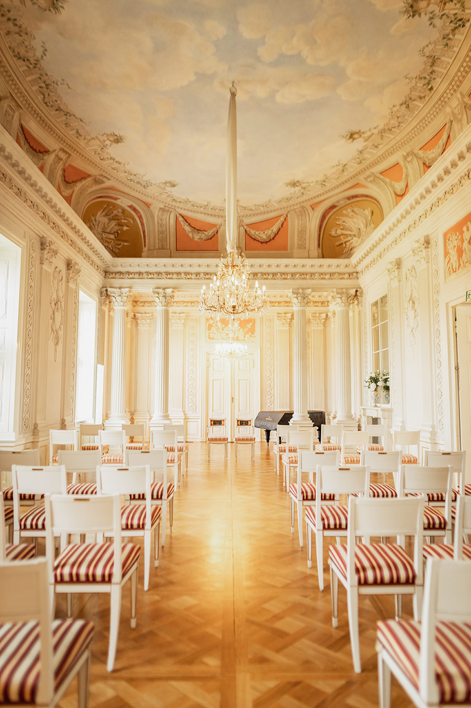
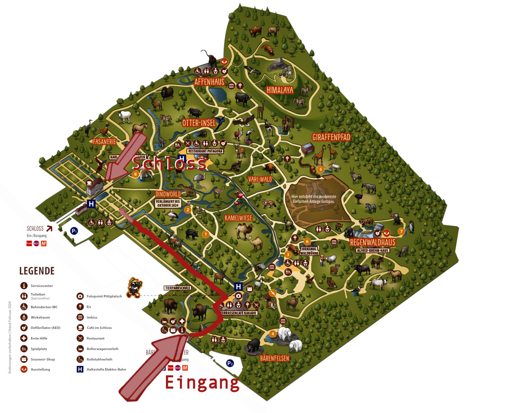

# Wir heiraten!

<v-row style="margin-top:30px; margin-bottom:30px">
  <v-col cols="12" lg="12" class="text-center">
    
  </v-col>

           
</v-row>

<v-row style="margin-top:30px; margin-bottom:30px">
  <v-col cols="12" lg="6" class="text-body-1" style="margin:auto;">
  
  ### Hello there!   

  Auf dieser Seite findet ihr mehr Informationen zu unserer Hochzeit - wie zum Beispiel Anfahrt, Hotels, Ablauf und so weiter. 

  Wir freuen uns auf euch!  
  Angelina & Dominik 
  <font-awesome-icon :icon="['fas', 'heart']" />
  </v-col>
</v-row>

<v-row style="margin-top:30px; margin-bottom:30px">
  <v-col cols="12" lg="6" class="text-body-1" style="margin:auto;">
  
  </v-col>  
  <v-col cols="12" lg="6" class="text-body-1" style="margin:auto;">

  ### Ablauf

  - **10:30** Treffen am Schloss
  - **11:00** Trauung
  - **12:00** Sekt im Schloss
  - ab **13:00** Spaß im Tierpark und Fotoshooting des Brautpaars
  - ab **18:00** Abendveranstaltung im Molly Malone's

  </v-col>        
</v-row>

<v-row style="margin-top:30px; margin-bottom:30px">
  <v-col cols="12" lg="6" class="text-body-1" style="margin:auto;">

  ### Abendveranstaltung

  Am Abend treffen wir uns in einem unserer absoluten lieblings-Pubs der Stadt: dem Molly Malone's nahe der Warschauer Straße. Dort werden wir den Tag mit einigen Getränken und eventuell ein paar Pizza-Bestellungen ausklingen lassen. Neben dem sehr guten Guinness gibt es im Molly Malone's eine weite Auswahl auch an alkoholfreien Getränken (zum Beispiel alkoholfreies Guinness!) und es ist genug Platz für uns reserviert. Und ja, Kartenzahlung ist hier tatsächlich möglich! :)

  Vom Tierpark kommt ihr ganz einfach mit der U5 zum Frankfurter Tor und dann mit einem kurzen Spaziergang zum Pub. Gibt uns bitte Bescheid, wenn ihr Abends dabei sein wollt, dass wir auf jeden Fall genug Plätze reservieren. 
  
  Wir freuen uns schon sehr darauf, mit euch unseren besonderen Tag zu feiern! 
  
  </v-col>    
  <v-col cols="12" lg="6" class="text-body-1" style="margin:auto;">
    <iframe src="https://www.google.com/maps/embed?pb=!1m18!1m12!1m3!1d3028.964508599572!2d13.44442217723232!3d52.51116897205883!2m3!1f0!2f0!3f0!3m2!1i1024!2i768!4f13.1!3m3!1m2!1s0x47a84f69e9c61c4b%3A0xc05cc0f97e8b3731!2sMolly%20Malone&#39;s!5e1!3m2!1sen!2sde!4v1738763397360!5m2!1sen!2sde" width="600" height="600" style="border:0;" allowfullscreen="" loading="lazy" referrerpolicy="no-referrer-when-downgrade"></iframe>
  </v-col>      
</v-row>

<v-row style="margin-top:30px; margin-bottom:30px">
  <v-col cols="12" lg="12" class="text-body-1" style="margin:auto;">

  ### Sonstiges

  - **Eintritt Tierpark**: Der Eintritt zum Tierpark geht auf uns. Entweder ihr habt die Tickets für den Tierpark zugeschickt bekommen oder meldet euch bei uns, damit wir sie euch in Berlin übergeben können. Wir haben auch ein kleines Spiel vorbereitet damit es definitiv eine Gelegenheit geben wird den Tierpark mit uns auch etwas zu erkunden.
  - **Fotos**: Wir haben einen professionellen Fotographen und wir werden euch die Bilder auch zur Verfügung stellen. Wir bitten daher während der Zeremonie keine Fotos zu machen. Danach und davor gerne, während dessen nicht!
  - **Kleiderordnung:** Die Braut trägt weiß. Bitte bedenkt, dass der Tierpark der Größte Europas ist und somit eine große Strecke zurückgelegt werden kann. Von
  High heels ist abzusehen. Falls ihr Probleme mit langem Laufen habt, gebt uns bitte Bescheid, sodass wir rechtzeitig Rollstühle im Tierpark reservieren können.
  - **Geschenke:** Dass ihr kommt, ist uns Geschenk genug. da ihr für uns den weiten Weg nach Berlin auf euch nehmen müsst!
  - **Verpflegung:** Wir planen mit einer kleinen Hochzeit. Es wird zwar natürlich einen Sektempfang geben, aber abseits davon haben wir kein großes Essen danach geplant. Im Tierpark gibt es jedoch einige Restaurants und Imbisse in allen Preiskategorien. Wir empfehlen die eingelegten Gurken :) Ansonsten kann man aber Verpflegung einfach mitbringen, da es viele Möglichkeiten für Picknicke gibt. 
  - **Marshmallow:** Wuff Wuff Hatschi. (Auch sie freut sich auf euch!)

  </v-col>    
</v-row>

<v-row style="margin-top:30px; margin-bottom:30px">
  <v-col cols="12" lg="6" class="text-body-1" style="margin:auto;">

  ### Anfahrt zum Tierpark

  Die Hochzeit findet im Schloss Friedrichsfelde im [Tierpark Berlin](https://maps.app.goo.gl/3pwzJQkYhjLJz45V6) statt. 
  Die nächste Nahverkehr-Haltestelle ist [U-Tierpark](https://www.bvg.de/de/verbindungen/stationsuebersicht/u-tierpark). Diese wird sowohl von der U5 als auch der Tram M17, 27 und 37, als auch ein paar Bussen befahren.

  Es gibt am Tierpark aber auch Parkplätze, solltet ihr mit dem Auto anreisen wollen. Für eine Tagesgebühr von 5,00 € stehen an beiden Tierpark-Eingängen Besucherparkplätze zur Verfügung. Unmittelbar nach Zahlung muss der Parkplatz wieder verlassen werden. An den Parkplatz-Automaten vor Ort wird ausschließlich Kartenzahlung akzeptiert.
  
  Im Tierpark selbst nehmt ihr am besten den Eingang Bärenschaufenster, lauft rechts an den Bisons vorbei zum Kakadu-Restaurant. Dort gegenüber seht ihr schon das Schloss und müsst nur noch dem schönen Weg geradeaus folgen. Auf dem Tierpark Plan könnt ihr den Weg sehen. 
  </v-col>    
  <v-col cols="12" lg="6" class="text-body-1" style="margin:auto;">
  
  </v-col>      
</v-row>

<v-row style="margin-top:30px; margin-bottom:30px">
  <v-col cols="12" lg="12" class="text-body-1" style="margin:auto;">

  ### Hotels

  Generall könnt ihr gerne jedes Hotel in Berlin buchen. Durch den guten Nahverkehr kommt ihr immer zum Tierpark. 
  Der Tierpark ist mit der U5 oder den Trams M17/27/37 angebunden. Am besten ihr sucht etwas im Osten der Stadt, 
  aber durch die U5 könnt ihr euch auch am Alexanderplatz, Unter den Linden, oder Brandenburger Tor sein - wenn ihr es etwas Touristischer wollt. 

  Hier sind ein paar Hotelempfehlungen von uns. Preise mit 2 Personen von 27.-29.03., 2 Nächte (ohne gewähr :)) 
  - [ABACUS Tierpark Hotel](https://www.booking.com/hotel/de/abacus-tierpark.de.html) - direkt am Tierpark! - 203€
  - [Hotel Mit Mensch](https://www.booking.com/hotel/de/mit-mensch.de.html) - Zwischen Tierpark und unserem Zuhause - 171€
  - [SmartMents Karlshorst](https://www.booking.com/hotel/de/smartments-business-berlin-karlshorst.de.html) - Zwischen Tierpark und unserem Zuhause - 226€
  - [Die Botschaft](https://www.booking.com/hotel/de/zeitgeist.de.html?) - Zwischen Tierpark und unserem Zuhause - 150€
  - [Ibis Budget Ost](https://www.booking.com/hotel/de/ibis-budget-berlin-ost.de.htm) - In Schöneweide, nicht weit von uns - 140€
  - [Habyt-The Waterfront](https://www.booking.com/hotel/de/habyt-the-waterfront-berlin.de.html) - Am Ostkreuz, gute Aussicht auf die Spree - 170€
  - [Park Inn by Radisson Berlin Alexanderplatz](https://www.booking.com/hotel/de/park-inn-berlin-alexanderplatz.de.html) - Am Alex - 263€
  - [Motel One Alexanderplatz](https://www.booking.com/hotel/de/motel-one-berlin-alexanderplatz-berlin.de.html?) - Am Alex - 302€
  - [Hampton by Hilton](https://www.booking.com/hotel/de/hampton-by-hilton-berlin-city-east-side-gallery.de.html) - An der East Side Gallery - 303€
  - [Hotel Adlon Kempinski Berlin](https://www.booking.com/hotel/de/adlon-kempinski-berlin.de.html) - Naja, das Adlon :) - 788€
  </v-col>         
</v-row>